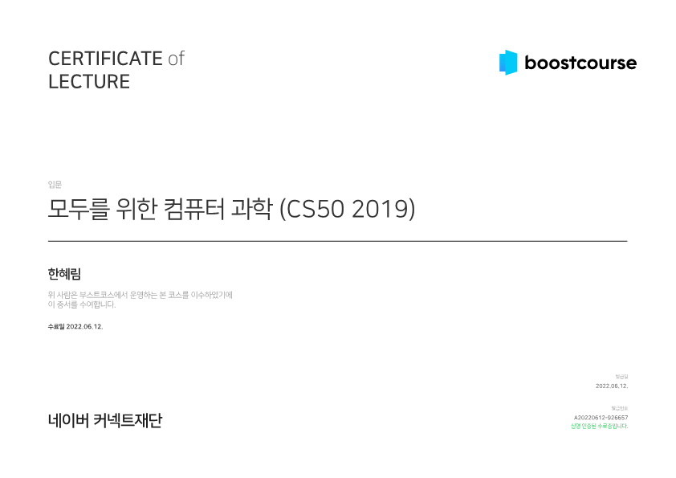

# 참고자료

## 1. 자료형, 형식지정자, 연산자

- C표준 라이브러리 - 위키백과, 우리 모두의 백과사전 (https://ko.wikipedia.org/wiki/C_%ED%91%9C%EC%A4%80_%EB%9D%BC%EC%9D%B4%EB%B8%8C%EB%9F%AC%EB%A6%AC)
- CS50 라이브러리 문서 (https://cs50.readthedocs.io/libraries/cs50/c/)
- 입력과 출력2 - [C언어 기초] (opentutorials.org) (https://opentutorials.org/module/3921/23575)

# 수료증

